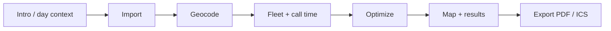

# Transport Coordinator — Design System

> **Status:** Applied in `apps/web` (dark monochrome + Inter)  
> **Reference:** Mobile survey flow — dark monochrome, Inter, step-by-step clarity  
> **Scope:** Import → route → reason → export (no live GPS, traffic ETA, or passenger tracking)

---

## 1. Design philosophy

Film transport planning is **mission-critical but batch-oriented**. Coordinators work in focused bursts (import call sheet, optimize, export manifests) — often on a phone at 4 AM. Drivers need **one task at a time**, not a dashboard.

| Principle | Meaning |
|-----------|---------|
| **Clarity over chrome** | One primary action per screen; large type; generous whitespace |
| **Step-by-step flows** | Multi-step tasks feel like a guided wizard, not a dense admin panel |
| **High contrast** | Readable in vehicles, offices, and pre-dawn light |
| **Honest feedback** | Progress bars, counts, and plain-language errors (geocode failures, infeasible routes) |
| **Deterministic first** | Maps and routes are truth from OR-Tools + Nominatim; AI explains, never silently overrides |

**Out of scope for this design system (v1):** live fleet map, passenger tracking, traffic overlays, PM budget dashboards.

---

## 2. Visual language (reference-inspired)

Inspired by a **minimal survey-style mobile app**: off-white background, black typography, single warm accent, rounded containers, fixed footer navigation.

### 2.1 Color tokens (target)

```css
/* Dark theme — primary (Swiss modern) */
--color-bg:           #0a0a0a;
--color-surface:      #141414;
--color-surface-muted:#1c1c1c;
--color-text:         #f2f2f2;
--color-text-muted:   #8a8a8a;
--color-border-subtle:#2a2a2a;

/* Accent — inverted mono (white CTA on dark UI) */
--color-accent:       #f2f2f2;
--color-accent-hover: #ffffff;
--color-accent-text:  #0a0a0a;

/* Semantic */
--color-success:      #1a7f4b;
--color-warning:      #b8860b;
--color-error:        #c0392b;
--color-error-bg:     #fdecea;
```

**Route colors on map** (keep distinguishable on light and dark map tiles):

| Van | Hex | Use |
|-----|-----|-----|
| 1 | `#f2f2f2` | White |
| 2 | `#bfbfbf` | Light gray |
| 3 | `#808080` | Mid gray |
| 4+ | `#e0e0e0`, `#5a5a5a` | Alternate grays |

### 2.2 Typography — Swiss modern (Inter)

- **Face:** `Inter` (Google Fonts), system fallback
- **Weights:** 400 body, 500 headings and UI — avoid heavy 700 except rare emphasis
- **Labels:** 11px uppercase, `letter-spacing: 0.1em`
- **Titles:** Medium weight, tight tracking (`-0.04em`), tabular nums on stats/ETAs
- **Radius:** Strict 4–8px; no card shadows — border-only separation
- **Mono:** `SF Mono` / Menlo for CSV and addresses

**Implementation:** Tokens in `apps/web/src/index.css`; coordinator and driver share dark theme.

### 2.3 Typography

| Role | Size | Weight | Example |
|------|------|--------|---------|
| Screen title | 1.5–1.75rem | 700 | "Import crew" |
| Section label | 0.75rem | 600 | Uppercase, letter-spacing 0.06em |
| Body | 1rem | 400 | Instructions, addresses |
| Meta | 0.875rem | 400 | API status, step hint |
| Stat | 2rem | 700 | Pickup count, distance |

**Font stack:** `Inter`, -apple-system, BlinkMacSystemFont, sans-serif.

### 2.4 Radius & spacing

| Token | Value | Use |
|-------|-------|-----|
| `--radius-sm` | 8px | Pills, small buttons |
| `--radius-md` | 12px | Cards, inputs, list rows |
| `--radius-lg` | 16px | Modals, map container |
| Page padding | 16px horizontal | Max width 480px centered |
| Card padding | 16–20px | Content blocks |
| Section gap | 12px | Between cards |
| Footer height | 72px + safe-area | Fixed bottom bar |

### 2.5 Elevation

Minimal shadows — rely on **border + surface contrast**:

```css
box-shadow: 0 1px 3px rgba(0, 0, 0, 0.06);  /* cards only */
```

---

## 3. Layout patterns (from reference)

### 3.1 Screen shell

Every full-screen flow uses the same chrome:

```
┌─────────────────────────────────────┐
│  [icon]  Category title        [×]  │  ← header: context + dismiss
├─────────────────────────────────────┤
│                                     │
│         Main content                │  ← scrollable
│         (question / form / map)     │
│                                     │
├─────────────────────────────────────┤
│  [←]              [ Primary CTA ]   │  ← fixed footer
└─────────────────────────────────────┘
```

| Zone | Rules |
|------|-------|
| **Header** | Small category icon + title (e.g. "Routes", "Import", "Driver"). Close (`×`) returns to previous context. No hamburger on mobile flows. |
| **Content** | Single focal task. Progress text top-right when wizard: `Step 2/4 (50%)`. |
| **Footer** | Back chevron left (secondary). Primary button right — full-width on narrow screens or 60% width min 120px. |

### 3.2 Reference → product mapping

| Reference pattern | Transport use |
|-------------------|---------------|
| **Intro / landing** | "Today's transport" — production name, shoot day, crew count, ~time estimate, **Start planning** |
| **Open text area** | Paste call sheet, CSV edit, AI reasoning question, delay note |
| **Tag / pill multi-select** | Departments to group, vehicles to include, failed geocode retry selection |
| **Radio list (single select)** | Choose import mode (CSV / AI), pick vehicle for lock assignment, driver vehicle selector |
| **Slider / scale** | Fleet size, vehicle capacity, call-time buffer (advanced) |
| **Progress indicator** | Import → geocode → optimize → export pipeline |

---

## 4. Components

### 4.1 Buttons

| Variant | Style | When |
|---------|-------|------|
| **Primary** | Fill `--color-accent`, white text, `--radius-md`, min-height 48px | One per screen: "Import & geocode", "Optimize", "Next" |
| **Secondary** | White fill, 1px black border, black text | "Load demo", "Back", alternate paths |
| **Ghost** | Text only, muted | Tertiary links |
| **Disabled** | 50% opacity, no pointer | Loading, invalid form |

Primary buttons span footer width on mobile when alone; sit right in split footer with back.

### 4.2 Cards

White surface, `--radius-md`, optional 1px border `#e0e0de`. Used for:

- Stat pairs (Pickups / Call time)
- Route result rows
- Fleet vehicle rows

### 4.3 Text inputs

| Type | Style |
|------|-------|
| **Textarea** | `--color-surface-muted` background, `--radius-md`, min 120px height, character hint bottom-right |
| **Time input** | Native `type="time"` in card; large tap target 48px |
| **Single line** | White surface, black border, 12px padding |

### 4.4 Selection pills (multi)

```
┌──────────┐  ┌──────────┐  ┌──────────┐
│ Camera   │  │  Grip    │  │  Sound   │   unselected: white + black border
└──────────┘  └──────────┘  └──────────┘

┌──────────┐
│ Camera ✓ │   selected: white fill + black text
└──────────┘
```

Use for: department filters, optional crew subset before optimize.

### 4.5 Radio list (single)

Full-width rows, `--radius-md`, radio icon left:

```
○  Van 1 — Driver A (4 seats)
●  Van 2 — Driver B (4 seats)    ← selected row: white background
○  Van 3 — Driver C (4 seats)
```

Use for: vehicle assignment locks, driver manifest vehicle picker.

### 4.6 Progress bar

Thin track (`--color-surface-muted`), fill `--color-accent`. Show for:

- Geocode batch (`3/12 addresses…`)
- Multi-step wizard
- Optimize in flight (indeterminate pulse if <2s)

### 4.7 Alerts

| Type | Treatment |
|------|-----------|
| Error | `--color-error-bg` card, `--color-error` text — e.g. infeasible route, geocode fail |
| Success | Muted green left border — "12/12 geocoded" |
| Warning | Amber border — partial geocode, tight call time |

Plain language required: *"3 addresses geocoded to the wrong city — check commas in CSV."*

### 4.8 Map container

- `--radius-lg` clip
- Min height 280px (coordinator), 200px (inline preview)
- Tiles: Carto Positron or Voyager for **light theme**; keep dark tiles as dark-mode option
- Depot: small white dot with ring
- Stop markers: default pin; popup name + address

### 4.9 Bottom tab bar (coordinator hub)

Fixed above safe area when not in wizard flow:

| Tab | Icon | Screen |
|-----|------|--------|
| Map | pin | Route map + results overlay |
| Routes | list | Import, optimize, results |
| Fleet | van | Vehicle count, capacity |
| History | clock | Run list, diff |

Active tab: white label; inactive: muted gray.

---

## 5. User flows & screens

### 5.1 Coordinator — happy path



| Step | Screen | Primary CTA | Reference pattern |
|------|--------|-------------|-------------------|
| 1 | Production context (optional) | Start | Intro |
| 2 | Import — CSV or AI tab | Import & geocode | Textarea + pills for mode |
| 3 | Geocoding progress | (auto) | Progress bar |
| 4 | Fleet + call time | Next | Slider + time input |
| 5 | Optimize | Optimize routes | Primary footer |
| 6 | Results + map | Export | Cards + map |
| 7 | Reasoning (future) | Ask | Textarea → LLM explanation |

### 5.2 Import screen (detail)

**Header:** `Import`  
**Progress:** Step 1/3  

**Mode pills:** `CSV (addresses)` | `AI call sheet` (disabled + hint if AI off)

**Body:**
- Label: "Crew data"
- Large textarea
- Hint: "Name and address only — no coordinates needed"
- Status: `12/12 geocoded` or list failed names (future)

**Footer:** `Load demo` (secondary) | `Import & geocode` (primary)

### 5.3 Route results (detail)

**Header:** `Routes`  
**Stats row:** 2 cards — total km, solver status  

**Route cards:** One per van — gray-scale route color, ordered stops, ETA, lock toggle  

**Map tab:** Full-width map, fit-bounds, colored polylines  

**Footer:** `PDF` | `ICS` (secondary) | `Re-optimize` (primary if edits)

### 5.4 Reasoning panel (planned)

LLM on structured JSON only — never raw solver control.

**Header:** `Explain`  
**Body:** Textarea — "Why is Anna on Van 2?" or auto-summary after optimize  
**Response:** Card with bullet explanation + suggested lock changes (confirm before apply)

**Mobile LLM:** Coordinator phone calls LAN API (Ollama on set Mac) or future on-device model via native shell.

### 5.5 Driver PWA

Simpler shell — **no tab bar**, single column:

| Screen | Content | Pattern |
|--------|---------|---------|
| Landing | Vehicle picker if multiple routes | Radio list |
| Manifest | Ordered stops, large ETA, address | Radio list rows |
| Stop detail | Navigate, Check-in, No-show | Primary per action |
| Delay | Slider 5–30 min + confirm | Slider |
| Offline | Cached manifest from localStorage | Same layout, muted "offline" badge |

Touch targets **min 48px**. High contrast; dark mode default for 4 AM.

---

## 6. Information hierarchy

What must be visible — aligned with production concept, trimmed to v1:

### Production level
- Shoot day / production title (intro screen)
- Base / depot location
- General call time

### Vehicle level
- Van name, driver, capacity, stop count
- Route color, total distance
- Ordered stop list with ETAs

### Passenger level
- Name, address (geocoded display name)
- Per-person call deadline (when implemented)
- Check-in status (driver)

### Route level
- Total distance, stop count
- Diff vs previous run (history tab)
- AI explanation summary (future)

---

## 7. Motion & feedback

| Interaction | Behavior |
|-------------|----------|
| Primary tap | 100ms scale 0.98 |
| Step transition | 200ms fade slide-up |
| Geocode | Determinate progress, ~1s per address |
| Optimize | Spinner if >500ms; success → auto-switch to Map tab |
| Error | Shake optional; always text message below footer |

Respect `prefers-reduced-motion`.

---

## 8. Accessibility

| Requirement | Implementation |
|-------------|----------------|
| Contrast | Body text ≥ 4.5:1 on bg; primary buttons black on white ≥ 4.5:1 |
| Touch | 48×48px min interactive |
| Focus | Visible 2px outline offset on keyboard nav |
| Screen reader | `aria-label` on icon-only buttons; live region for geocode progress |
| Time | Expose ISO + localized display |

Target **WCAG 2.1 AA** for coordinator and driver views.

---

## 9. Export & print

| Export | Format | Design notes |
|--------|--------|--------------|
| Driver manifest | PDF | Black on white, route color legend, QR to PWA route (future) |
| Calendar | ICS | No UI — file download |
| Run snapshot | JSON | API; for integrations |

Print styles: hide tab bar and footer; map thumbnail optional in PDF.

---

## 10. Implementation roadmap

| Phase | UI work |
|-------|---------|
| **Now** | Dark monochrome + Inter in `index.css` |
| **Phase 4** | Shared components (Pill, ProgressBar, ScreenShell) |
| **Phase 4** | Geocode progress bar; failed-address list component |
| **Phase 3+** | Reasoning panel; NL edit confirm step |
| **Later** | Dark mode toggle; white-label CSS variables for enterprise |

### File map (current → target)

```
apps/web/src/
  index.css          → theme tokens (light/dark)
  App.css            → coordinator components
  DriverView.css     → driver-specific (larger type)
  components/        → shared Button, Card, Pill, RadioList, ProgressBar, ScreenShell
```

Extract repeated patterns from reference into reusable components before restyling all screens.

---

## 11. What we explicitly do not design (v1)

- Live GPS fleet board
- Traffic-adjusted ETA UI
- Passenger tracking / SMS notifications
- PM budget dashboard
- Real-time websocket status colors (green/yellow/red fleet)

These remain out of scope per product direction; revisit in commercial tier spec if needed.

---

## 12. Reference anchor

Visual inspiration: **mobile survey flow** — strict grid, monochrome palette, Inter type, fixed bottom navigation with back + primary CTA, step progress, pill and radio selection patterns.

Adapt—not copy—the survey metaphor: coordinators complete a **"plan today's pickups"** questionnaire whose output is routes and manifests, not form submissions.

---

*See also: [memory.md](../memory.md) (product roadmap), [on-prem-install.md](./on-prem-install.md) (deployment).*
